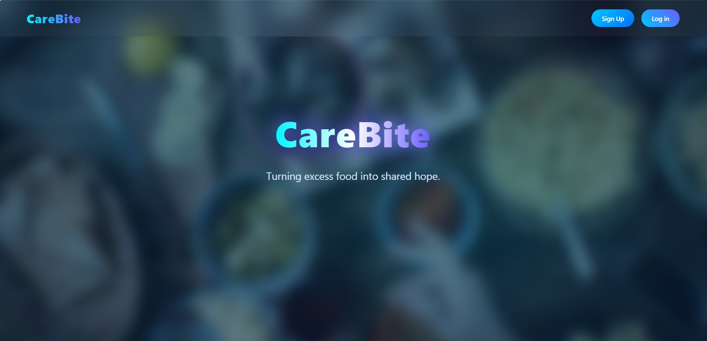
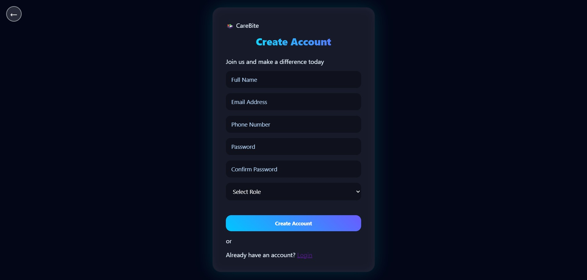
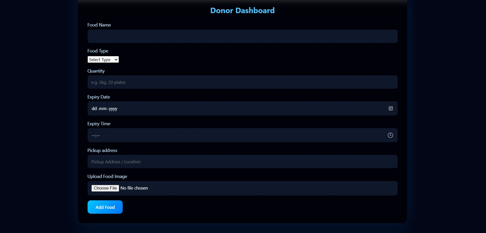

<p align="center">
  
</p>

# CareBite 🍱

## Basic Details

### Team Name: CodeSprout

### Team Members
- Member 1: Angela Elsa John - MITS,Kochi
- Member 2: Anjana R - MITS,Kochi

### Hosted Project Link
https://care-bite.vercel.app/index.html

### Project Description
CareBite is a web-based food donation platform that connects food donors (restaurants, households, and events) with NGOs and receivers who need food, and volunteers who pick up and deliver it. It helps reduce food waste and fight hunger by coordinating real-time food donations across communities.

### The Problem statement
Tonnes of good food gets thrown away every day while people nearby go hungry. 
The problem isn't shortage — it's connection. Donating food is slow, 
unorganized, and by the time it's arranged, the food has already gone bad. 
There had to be a better way.

### The Solution
CareBite is the bridge that should have always existed.

The moment a donor posts surplus food, it goes live on our platform 
instantly. Nearby NGOs and receivers can see it, claim it, and a volunteer 
is already on their way to pick it up — all within minutes, not hours.

No phone calls. No emails. No food wasted waiting.

We built three powerful dashboards — one for donors to post food in seconds, 
one for receivers to find and claim donations nearby, and one for volunteers 
to accept pickups and track deliveries in real time. Every donation has a 
live status — from the moment it's posted to the moment it reaches someone 
who needs it.

CareBite doesn't just move food. It moves people to act faster, give more, 
and waste less. Because when technology meets compassion, nobody has to go 
hungry tonight.

---

## Technical Details

### Technologies/Components Used

**For Software:**
- Languages used: HTML5, CSS3, JavaScript (ES6+)
- APIs used: Browser Geolocation API, FileReader API
- Storage: localStorage (Browser-based)
- Fonts: Google Fonts (Poppins)
- Tools used: VS Code, Git, GitHub, Live Server


---

## Features

List the key features of your project:

- Feature 1: Three-Role System — CareBite supports three distinct user roles 
  (Donor, Receiver/NGO and Volunteer) each with their own personalized 
  dashboard and access controls.

- Feature 2: Real-Time Food Donation Tracking — Every donation has a live 
  status that updates in real time from Available → Claimed → Pickup Assigned 
  → Delivered, so everyone knows exactly where the food is.

- Feature 3: Location-Based Matching — Using the Browser Geolocation API, 
  CareBite automatically detects the receiver's location and sorts available 
  donations by distance, showing the closest food first.

- Feature 4: Volunteer Delivery System — Volunteers can browse claimed 
  donations, accept pickup tasks, and mark deliveries as complete — creating 
  a full end-to-end food delivery chain.

- Feature 5: Expiry Alert System — Donations expiring within 2 hours are 
  automatically flagged with a warning so receivers and volunteers can 
  prioritize urgent pickups.

- Feature 6: Food Image Upload — Donors can upload photos of their food so 
  receivers know exactly what they're claiming before they commit.

## Implementation

### For Software:

#### Installation
```bash
No installation needed!
Just clone the repository and open with Live Server
git clone https://github.com/angela0526/CareBite.git
cd CareBite
```

#### Run
```bash
Open frontend/index.html using Live Server in VS Code
Right click index.html → Open with Live Server
App will open at http://127.0.0.1:5500
```
## Project Documentation

### For Software:

#### Screenshots (Add at least 3)

*Landing Page — CareBite's home page with hero section, about section and contact form*


*Login Page — Role-based login for Donors, Receivers and Volunteers*


*Register Page — Role-based registration for Donors, Receivers and Volunteers*


*Donor Dashboard — Donors can post food donations with name, type, quantity, expiry and image*


*Receiver Dashboard — Receivers can browse available donations sorted by distance and claim them*


*Volunteer Dashboard — Volunteers can accept pickup tasks and mark deliveries as complete*


## Additional Documentation

### For Web Projects:

#### API Documentation

Since CareBite is a frontend-only application, all data is handled through 
the Browser's localStorage API. No external API calls are made.

**Data Storage Keys:**

**cb_users**
- **Description:** Stores all registered users
- **Type:** Array of user objects
- **Example:**
```json
{
  "name": "Angela John",
  "email": "angela@gmail.com",
  "phone": "9876543210",
  "role": "donor",
  "lat": 10.123,
  "lng": 76.456
}
```

**cb_donations**
- **Description:** Stores all food donations and their status
- **Type:** Array of donation objects
- **Example:**
```json
{
  "id": 1234567890,
  "donorName": "Angela John",
  "foodName": "Biryani",
  "foodType": "Non-Veg",
  "quantity": "20 plates",
  "expiryDate": "2025-02-21",
  "expiryTime": "20:00",
  "status": "Available",
  "claimedBy": null,
  "volunteerName": null
}
```

**cb_currentUser**
- **Description:** Stores the currently logged in user
- **Type:** Single user object


---

## AI Tools Used

**Tool Used:** Claude AI (claude.ai)

**Purpose:** Used for guidance and assistance during development
- Building and structuring the project from scratch
- Debugging JavaScript functions and localStorage logic
- Implementing GPS-based location sorting feature
- Writing backend architecture with Node.js and MongoDB


**Human Contributions:**
- Project idea and concept design
- UI/UX design decisions and color scheme
- Custom CSS styling and animations
- Testing and debugging the application
- Feature planning and user flow design
- Final integration and presentation

---

## Team Contributions

- Angela John: Auth pages, login pages, Volunteer dashboard, Testing and debugging,Location feature
- Anjana R: Frontend development, Landing page, Donor dashboard, Receiver dashboard,
  CSS styling 

---

## License

This project is licensed under the MIT License.

The MIT License means anyone can use, copy, modify and distribute 
this project freely as long as they give credit to the original authors.

---

Made with ❤️ at TinkerHub
